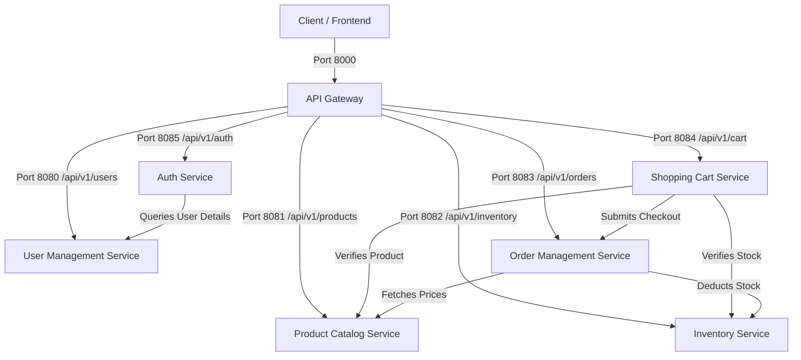

# E-commerce Backend Suite

A modern, highly-scalable, microservices-based e-commerce backend platform built in Go.

## Architectural Design & Deep-Dive

For a complete breakdown of the architectural patterns, scalability metrics, state design, and sequence request diagrams, please refer to the detailed [System Architecture Design Guide](file:///c:/Users/Pranav/OneDrive/Desktop/Code/E-commerceBackend/docs/architecture/system_design.md).

You can also view a quick-reference list of all request and response payloads in the [API Endpoints Reference Guide](file:///c:/Users/Pranav/OneDrive/Desktop/Code/E-commerceBackend/docs/api/endpoints.md).

## Infrastructure & Operations

The `infrastructure/` folder holds the tools, provisioning scripts, configurations, and environment configurations needed to deploy and operate the backend suite:

* **[Docker](file:///c:/Users/Pranav/OneDrive/Desktop/Code/E-commerceBackend/infrastructure/docker)**: Contains multi-stage container files (`Dockerfile.gateway`, `Dockerfile.inventory`, `Dockerfile.order`) and `docker-compose.yml` for unified stack orchestration.
* **[Kubernetes](file:///c:/Users/Pranav/OneDrive/Desktop/Code/E-commerceBackend/infrastructure/kubernetes)**: Contains manifest declarations (`gateway.yaml`, `inventory.yaml`, `postgres.yaml`, `redis.yaml`, `ingress.yaml`) for cloud deployments.
* **[Terraform (IaC)](file:///c:/Users/Pranav/OneDrive/Desktop/Code/E-commerceBackend/infrastructure/terraform)**: Holds infrastructure provisioning configurations for AWS, GCP, and Azure.
* **[Nginx Proxy](file:///c:/Users/Pranav/OneDrive/Desktop/Code/E-commerceBackend/infrastructure/nginx)**: Centralized reverse proxy configuration, rate limiting, and SSL setups.
* **[Monitoring](file:///c:/Users/Pranav/OneDrive/Desktop/Code/E-commerceBackend/infrastructure/monitoring)**: Prometheus metric scraping, Loki logs collector, Tempo tracing, and Grafana dashboard configurations.
* **[Databases (Postgres & Redis)](file:///c:/Users/Pranav/OneDrive/Desktop/Code/E-commerceBackend/infrastructure/postgres)**: Database schemas (`schema.sql`), initialization scripts (`init.sql`), local seeds (`seed.sql`), and Redis configurations.
* **[Messaging (Kafka)](file:///c:/Users/Pranav/OneDrive/Desktop/Code/E-commerceBackend/infrastructure/kafka)**: Isolated event brokers compose configs and automated topic setup CLI scripts.
* **[Local Configs](file:///c:/Users/Pranav/OneDrive/Desktop/Code/E-commerceBackend/infrastructure/local)**: Environment profiles (`.env.local`, `.env.dev`, `.env.test`).

## Swagger API Interface

The E-commerce Backend suite is equipped with a unified Swagger API UI served directly at the API Gateway level (port `8000`).

To explore and test the endpoints, start the gateway and navigate to:
* **Swagger UI Portal**: `http://localhost:8000/swagger/index.html`
* **Swagger Schema Specs**: `http://localhost:8000/swagger/doc.json`

## High-Level System Architecture

The application is structured as a suite of decentralized microservices. All client communications flow through the API Gateway, which handles routing, security checks, and token-based user authentication.



---

## Component Registry & Port Configuration

| Port | Service | Description | Downstream Dependencies |
| :--- | :--- | :--- | :--- |
| **8000** | [API Gateway](file:///c:/Users/Pranav/OneDrive/Desktop/Code/E-commerceBackend/service/api-gateway) | Central entry point, performs routing, and JWT authorization checks. | All downstream services |
| **8085** | [Auth Service](file:///c:/Users/Pranav/OneDrive/Desktop/Code/E-commerceBackend/service/auth-service) | Handles login, user registration, JWT generation, and token refresh. | User Management Service |
| **8080** | [User Management](file:///c:/Users/Pranav/OneDrive/Desktop/Code/E-commerceBackend/service/UserManagementService) | Stores profiles, credentials, and identity information. | *None* |
| **8081** | [Product Catalog](file:///c:/Users/Pranav/OneDrive/Desktop/Code/E-commerceBackend/service/ProductCatalogService) | Stores products, prices, descriptions, and catalog categories. | *None* |
| **8082** | [Inventory Service](file:///c:/Users/Pranav/OneDrive/Desktop/Code/E-commerceBackend/service/InventoryService) | Tracks and updates stock levels, and performs inventory reservations. | *None* |
| **8083** | [Order Management](file:///c:/Users/Pranav/OneDrive/Desktop/Code/E-commerceBackend/service/OrderManagementService) | Handles order placement, status updates, and cancellation restock loops. | Product Catalog, Inventory |
| **8084** | [Shopping Cart](file:///c:/Users/Pranav/OneDrive/Desktop/Code/E-commerceBackend/service/ShoppingCartService) | Manages user shopping carts, item quantities, and triggers checkouts. | Product Catalog, Inventory, Order Management |

---

## Developer Guide

### Prerequisites
- [Go 1.25+](https://go.dev/)

### Automation Scripts

The `scripts/` folder provides automated shortcuts for development, testing, and deployments:

| Script | Purpose | Command |
| :--- | :--- | :--- |
| **setup.sh** | One-time setup: tidies service modules, pulls docker containers, and installs code generation CLI tools. | `./scripts/setup.sh` |
| **dev.sh** | Spins up the microservices stack (running docker-compose). | `./scripts/dev.sh` |
| **build.sh** | Compiles all microservice modules and builds target binaries locally. | `./scripts/build.sh` |
| **test.sh** | Executes full unit/integration test suites across the workspace. | `./scripts/test.sh` |
| **lint.sh** | Vets Go files for static patterns and syntax issues. | `./scripts/lint.sh` |
| **migrate.sh** | Runs database migrations across microservices. | `./scripts/migrate.sh` |
| **rollback.sh** | Reverts the last migration step. | `./scripts/rollback.sh` |
| **seed.sh** | Automated REST client seed: logs in as admin and populates sample catalog items via API calls. | `./scripts/seed.sh` |
| **cleanup.sh** | Deletes build binaries, caches, and temp folders. | `./scripts/cleanup.sh` |
| **generate.sh** | Runs automated builders (e.g. Swaggo). | `./scripts/generate.sh` |
| **release.sh** | Packages and tags production-ready Docker containers. | `./scripts/release.sh` |

### Running Services Locally

You can launch each service by executing the main entry point from its directory:

```bash
# To run API Gateway:
cd service/api-gateway
go run cmd/gateway/main.go

# To run Shopping Cart Service:
cd service/ShoppingCartService
go run cmd/server/main.go
```

### Running Test Suite

All services are fully tested with unit and integration tests covering the repository, service layer, and controller handlers. You can run all test suites in the workspace using the following PowerShell command:

```powershell
Get-ChildItem -Path service -Directory | ForEach-Object { Write-Output "--- Testing $_.Name ---"; Push-Location $_.FullName; go test -v ./...; Pop-Location }
```
