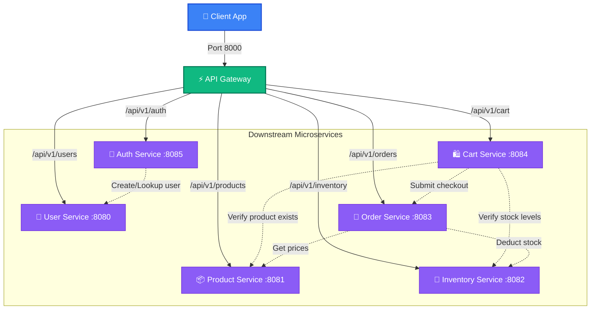
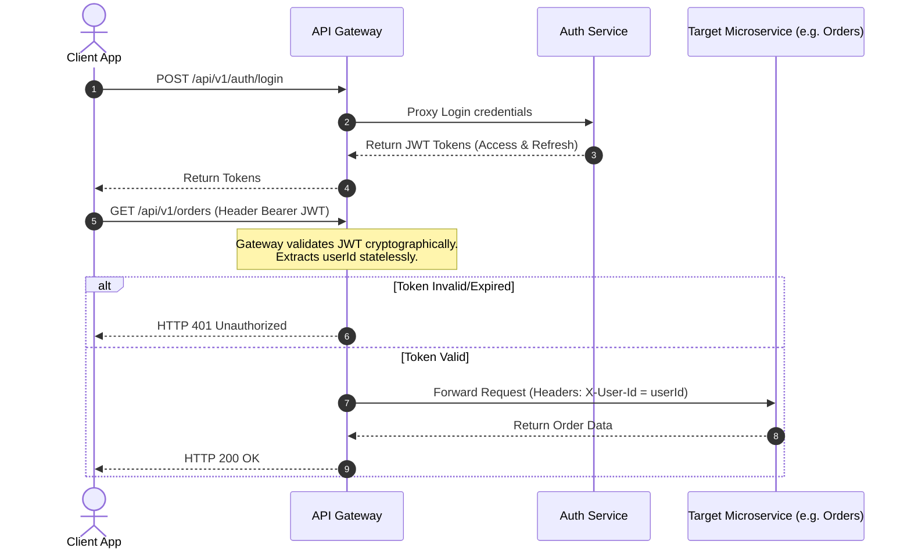
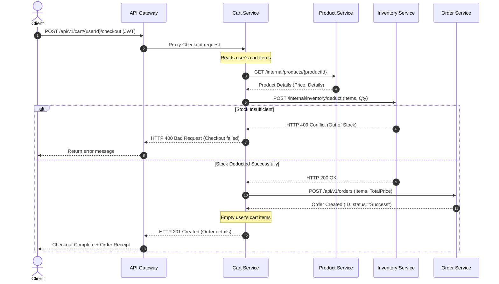
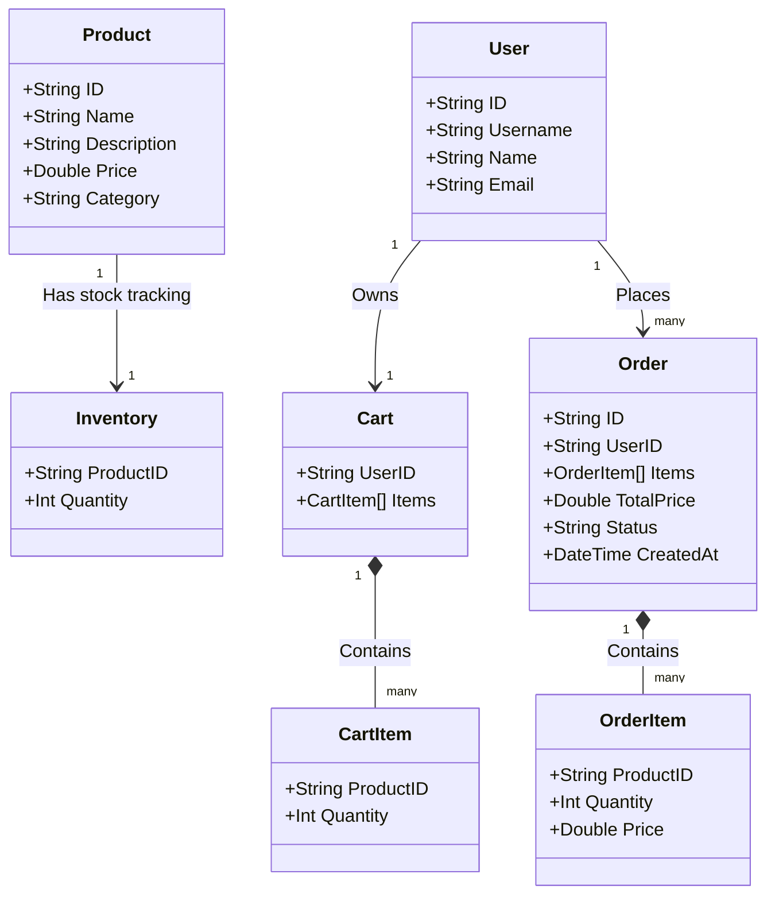

# System Architecture & Design Documentation

This document describes the architectural patterns, feature sets, scalability strategies, and detailed communication flows within the E-commerce Backend Suite.

---

## Architectural Patterns

The E-commerce Backend suite is built using modern cloud-native architectural patterns designed for microservice autonomy, stateless execution, and high performance.

### 1. API Gateway Pattern
All incoming client traffic enters the system via a single entry point (the **API Gateway** on port `8000`).
* **Routing & Reverse Proxying**: Routes are matched by prefix and forwarded dynamically using a reverse proxy to downstream microservices.
* **Centralized Cross-Cutting Concerns**: Authentication checks, CORS, rate limiting, and request headers enrichment are performed at the gateway level.
* **Security & Auth Offloading**: Prevents individual services from repeating authentication logic.

### 2. Stateless Service Pattern
Every service is entirely stateless. State is managed by in-memory repositories (which map directly to container-attached datastores like Postgres, MySQL, or Redis in production).
* **Benefits**: Enables instant scale-up/scale-down and container restarts without data corruption or configuration state drift.

### 3. Database-per-Service Pattern
To ensure strict decoupling, services do not share a common database.
* **Encapsulation**: Cart, Order, Product, User, and Inventory data are strictly isolated.
* **Cross-Service Verification**: Services query each other's public endpoints (via HTTP) to verify integrity (e.g., the Cart Service requests the Product Service to verify if a product exists before adding it to a cart).

### 4. Layered Clean Architecture (Inside Services)
Each microservice is structured into clean separation of concerns:
```
┌────────────────────────────────────────────────────────┐
│ API / Router (Exposes REST endpoints, parses requests)  │
└───────────────────┬────────────────────────────────────┘
                    ▼
┌────────────────────────────────────────────────────────┐
│ Service Layer (Core business rules, validations)       │
└───────────────────┬────────────────────────────────────┘
                    ▼
┌────────────────────────────────────────────────────────┐
│ Repository / Client (Data access, downstream RPCs)     │
└────────────────────────────────────────────────────────┘
```

---

## Scale & Scalability Strategy

This microservices design is built to scale efficiently under load using the following mechanisms:

### 1. Independent Horizontal Scaling
Because downstream services are decoupled:
* **Product Catalog Service**: Can be scaled to dozens of instances to handle read-heavy catalog searches during shopping sales without wasting resources scaling the write-heavy **Order Management Service**.
* **API Gateway**: Can run multiple replicas behind an external Load Balancer (like AWS ALB or Nginx).

### 2. Shared-Secret JWT Authentication Scalability
* JWT verification uses an HMAC-SHA256 signature checked using a secret key.
* The API Gateway verifies the token cryptographically **without** making a database query or an auth-service HTTP request for every single call. This eliminates the Auth Service database bottleneck.

### 3. Future Scalability Roadmaps (Production Ready)
* **Caching (Redis)**: Introduce Redis caching at the API Gateway or Product Catalog layer to resolve catalog reads instantly.
* **Event-Driven Architecture (Kafka / RabbitMQ)**: Decouple the Checkout flow. Instead of synchronous HTTP chain requests during checkout (Cart -> Order -> Inventory), the Cart Service can emit a `checkout.submitted` event, and the Order and Inventory services can consume it asynchronously to guarantee final consistency.

---

## System Diagrams

A comprehensive backend system's documentation typically contains four key types of diagrams to represent different facets of the system. They are detailed below.

### 1. High-Level Component & Communication Diagram
*Describes the layout of services, their entrypoints, and communication bounds.*



### 2. Authentication & Authorization Flow Sequence
*Shows how the token-based security check is processed statelessly at the Gateway.*



### 3. Shopping Cart Checkout Sequence Diagram
*Shows the chain of interactions between multiple services to successfully place an order.*



### 4. Entity Relation Schema & Context Bounds
*Outlines data models, types, and context borders.*


